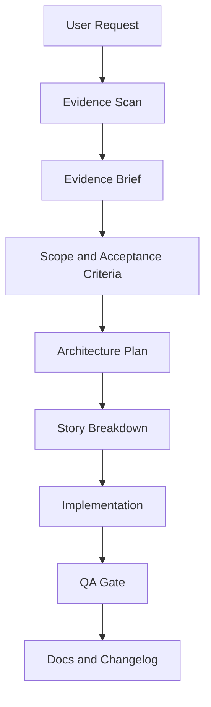

# BMAD Twelve Adaptation Proposal

## 1. Muc tieu

Ap dung BMAD Method vao Twelve theo huong evidence-first, phu hop voi du an phuc dung Loạn 12 Sứ Quân tu Java/J2ME sang backend .NET 9 va React Native.

Muc tieu khong phai la tang tai lieu hinh thuc, ma la tao workflow lap lai duoc de AI va human cung lam viec co ky luat:

- Moi thay doi gameplay/protocol phai co evidence hoac duoc gan nhan remake policy.
- Moi feature lon duoc chia thanh story nho co acceptance criteria ro rang.
- Moi story co gate QA rieng truoc khi duoc xem la hoan thanh.
- Moi code change cap nhat dung reconstruction doc va changelog khi can.

## 2. BMAD Method o muc khai niem

BMAD Method la mot workflow phat trien phan mem theo huong agentic planning. Thay vi de AI nhay thang vao code, BMAD chia cong viec theo vai tro va artifact:

- Analyst: thu thap context, evidence, user need, constraint.
- PM: chuyen need thanh scope, requirement, acceptance criteria.
- Architect: thiet ke technical approach, boundaries, dependencies.
- Scrum Master hoac Story Manager: chia thanh story nho de implement.
- Dev: code theo story da chot.
- QA: review behavior, risk, regression, testing, documentation.

Gia tri chinh cua BMAD la context engineering: moi agent nhan dung thong tin can thiet, dung format, dung muc tieu.

## 3. Vi sao Twelve can bien the rieng

Twelve khong phai greenfield product thong thuong. Source of truth cua du an la Java client/JAR, decompiled source, asset/config, video/image reference va cac reconstruction document.

Neu ap dung BMAD goc qua may moc, AI co the tao PRD hoac user story theo logic san pham moi va vo tinh lam lech hanh vi game goc. Vi vay Twelve can bien the:

Twelve BMAD = BMAD Method + Reconstruction Evidence Gate

## 4. Workflow de xuat

## 5. Artifact can chuan hoa

### 5.1 Evidence Brief

Dung truoc moi task phuc dung gameplay/protocol/UI flow.

Noi dung bat buoc:

- User request.
- Java evidence da co.
- Config/asset/video evidence da co.
- Reconstruction docs lien quan.
- Unknowns va missing evidence.
- Remake policy pending approval.
- Risk neu suy dien sai.

Noi luu de xuat: `plans/<feature>-evidence-brief.md`.

### 5.2 Reconstruction Scope

Thay cho PRD san pham thong thuong.

Noi dung bat buoc:

- Goal.
- Non-goals.
- Behavior can khop Java.
- Behavior la remake policy.
- Affected packet command/tag/raw values.
- Affected backend/client/database/docs.
- Acceptance criteria.

Noi luu de xuat: `plans/<feature>-reconstruction-scope.md`.

### 5.3 Architecture Plan

Dung khi feature cham nhieu layer.

Noi dung bat buoc:

- Core domain changes.
- Application service/handler/factory changes.
- Infrastructure repository/database changes.
- Client screen/hook/service changes.
- Protocol compatibility notes.
- Security and validation notes.
- Build/check plan.

Noi luu de xuat: `plans/<feature>-architecture-plan.md`.

### 5.4 Story File

Dung de Code mode implement tung phan nho.

Noi dung bat buoc:

- Story title.
- Context summary.
- Files likely touched.
- Implementation checklist.
- Acceptance criteria.
- Validation command.
- Docs/changelog update target.
- Explicit constraints: no invented fallback, keep raw Java values, separate evidence from policy.

Noi luu de xuat: `plans/<feature>-story-001.md`.

### 5.5 QA Gate

Dung sau khi Dev implement.

Noi dung bat buoc:

- Build/check result.
- Behavior checklist.
- Protocol/raw value checklist.
- Evidence traceability checklist.
- Regression risk.
- Docs/changelog updated.
- Final decision: pass, pass with notes, or block.

Noi luu de xuat: `plans/<feature>-qa-gate.md`.

## 6. Mapping voi cau truc hien tai

- `.agent/agents/`: da co role gan voi BMAD, co the bo sung role Evidence Auditor hoac Story Manager neu can.
- `.agent/skills/`: da co architecture, binary-protocol, clean-code, database-design, frontend-design, game-mechanics, powershell-windows.
- `.agent/workflows/plan.md`: nen nang cap thanh planning workflow co Evidence Brief va Reconstruction Scope.
- `.agent/workflows/debug.md`: da phu hop, chi can bo sung evidence/regression gate neu bug lien quan gameplay/protocol.
- `plans/`: noi tot nhat de luu artifact theo task.
- `docs/` va `*_SYSTEM_RECONSTRUCTION.md`: source of truth cho evidence va status.
- `CHANGELOG.md`: noi tong ket thay doi lon sau task.

## 7. Muc ap dung de xuat

### Muc nhe

Tao template trong `plans/`:

- `plans/_templates/evidence-brief-template.md`
- `plans/_templates/reconstruction-story-template.md`
- `plans/_templates/qa-gate-template.md`

Phu hop neu muon bat dau nhanh, it thay doi `.agent`.

### Muc vua

Ngoai cac template tren, cap nhat workflow:

- `.agent/workflows/plan.md`
- `.agent/workflows/debug.md`
- them `.agent/workflows/reconstruction.md`

Phu hop nhat voi Twelve vi can ky luat evidence nhung khong qua nang.

### Muc day du

Tao BMAD-style operating model rieng:

- Them/cap nhat agents: Analyst, PM, Architect, Story Manager, Dev, QA, Evidence Auditor.
- Them workflow end-to-end cho epic/story/QA.
- Co checklist bat buoc truoc moi implementation.

Phu hop khi du an co nhieu nguoi/nhieu AI agent lam song song.

## 8. Khuyen nghi

Nen chon muc vua.

Ly do:

- Twelve da co `.agent`, `plans`, `docs`, reconstruction docs nen khong can khoi tao tu dau.
- Muc vua du de chong AI suy dien sai logic Java.
- Khong tao qua nhieu artifact gay cham tien do.
- De Code/Debug/Architect mode tiep tuc lam viec theo quy trinh hien tai.

## 9. Todo trien khai neu user dong y muc vua

- Tao `plans/_templates/evidence-brief-template.md`.
- Tao `plans/_templates/reconstruction-scope-template.md`.
- Tao `plans/_templates/reconstruction-story-template.md`.
- Tao `plans/_templates/qa-gate-template.md`.
- Tao `.agent/workflows/reconstruction.md`.
- Cap nhat `.agent/workflows/plan.md` de bat buoc scan evidence truoc khi plan.
- Cap nhat `.agent/workflows/debug.md` de them regression/evidence check cho gameplay/protocol bugs.
- Cap nhat `CHANGELOG.md` sau khi them workflow/templates.
